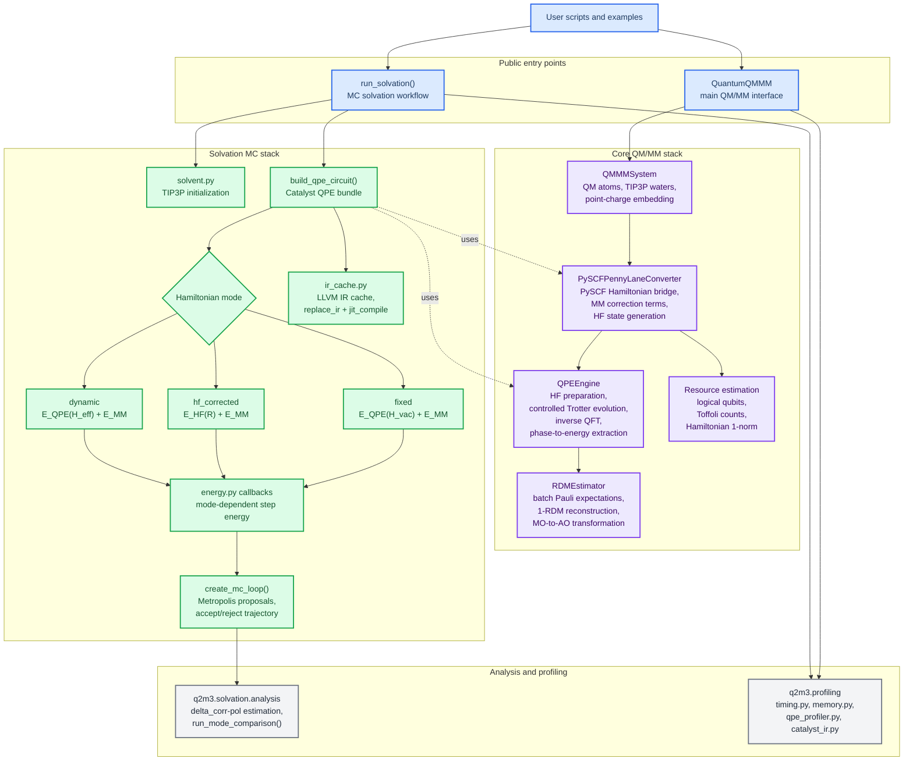

# q2m3: Quantum-QM/MM Framework

[](https://www.python.org/downloads/)
[](https://opensource.org/licenses/MIT)
[](https://pennylane.ai/)
[](https://pyscf.org/)

> **MVP Status** - Hybrid Quantum-Classical QM/MM for Early Fault-Tolerant Quantum Computers (EFTQC)

A proof-of-concept framework for hybrid quantum-classical QM/MM (Quantum Mechanics/Molecular Mechanics) calculations. The framework bridges PySCF classical computations with PennyLane quantum circuits using Quantum Phase Estimation (QPE) algorithms.

## Overview

q2m3 demonstrates the integration of QPE algorithms with molecular mechanics environments for quantum chemistry simulations. The framework implements **real quantum circuits** with Trotter time evolution, MM point charge embedding, and quantum 1-RDM measurement.

**Key Capabilities:**

- Standard QPE circuit with Trotter time evolution (`qml.TrotterProduct`)
- PySCF to PennyLane Hamiltonian conversion with MM embedding
- QM/MM system setup with TIP3P water solvation
- GPU acceleration via `lightning.gpu` device (4.3x speedup)
- Catalyst `@qjit` JIT compilation support
- Quantum 1-RDM measurement for Mulliken population analysis
- EFTQC resource estimation (Toffoli gates, logical qubits, 1-norm)
- Circuit visualization via `qml.draw(decimals=None, level=0)`
- Solvation effect analysis (vacuum vs explicit MM embedding)
- Monte Carlo solvation sampling with three QPE modes (`fixed`/`hf_corrected`/`dynamic`)
- Catalyst LLVM IR caching for compilation optimization across MC steps
- δ_corr-pol (correlation-polarization coupling) analysis via `q2m3.solvation.analysis`

## Quick Start

### Requirements

- Python >= 3.11
- CUDA >= 12.0 (optional, for GPU acceleration)
- uv package manager (recommended)

### Installation

```bash
# Clone repository
git clone https://github.com/yjmaxpayne/q2m3.git
cd q2m3

# Install uv (if not already installed)
curl -LsSf https://astral.sh/uv/install.sh | sh

# Sync all dependencies (recommended)
uv sync --all-extras

# Or install specific extras:
uv sync                    # Core only
uv sync --extra dev        # Development tools
uv sync --extra gpu        # GPU support (requires NVIDIA GPU)
uv sync --extra catalyst   # Catalyst JIT support
```

### Run Examples

```bash
# Activate virtual environment
source .venv/bin/activate

# Run minimal validation (H2 + TIP3P waters)
python examples/h2_qpe_validation.py

# Run MC solvation (H2 + 10 TIP3P waters, Catalyst required)
python examples/h2_mc_solvation.py

# Optional heavier ionic example; use a 16 GB+ RAM machine
python examples/h3o_mc_solvation.py
```

See [`examples/README.md`](./examples/README.md) for the maintained split
between first-run entry points, high-memory H3O+ examples, and longer
reproducibility scripts that generate local `data/output/` artifacts.

### Basic Usage

```python
import numpy as np
from q2m3.core import QuantumQMMM
from q2m3.core.qmmm_system import Atom

# Define H3O+ geometry (Angstrom)
h3o_atoms = [
    Atom("O", np.array([0.0, 0.0, 0.0]), charge=-2.0),
    Atom("H", np.array([0.96, 0.0, 0.0]), charge=1.0),
    Atom("H", np.array([-0.48, 0.831, 0.0]), charge=1.0),
    Atom("H", np.array([-0.48, -0.831, 0.0]), charge=1.0),
]

# Configure QPE parameters
qpe_config = {
    "use_real_qpe": True,
    "n_estimation_wires": 4,      # Precision bits
    "base_time": "auto",          # Auto-computed to avoid phase overflow
    "n_trotter_steps": 3,         # Safe H3O+ example default
    "n_shots": 100,
    "active_electrons": 4,        # Active space
    "active_orbitals": 4,
    "device_type": "auto",        # Auto-select best device
}

# Run QM/MM calculation with solvation
qmmm = QuantumQMMM(
    qm_atoms=h3o_atoms,
    mm_waters=8,
    qpe_config=qpe_config,
)

results = qmmm.compute_ground_state()
print(f"Ground State Energy: {results['energy']:.6f} Hartree")
print(f"HF Reference Energy: {results['energy_hf']:.6f} Hartree")

# Visualize circuits
circuits = qmmm.draw_circuits()
print(circuits["qpe"])  # QPE circuit diagram
print(circuits["rdm"])  # RDM measurement circuit
```

## Architecture



## QPE Circuit Implementation

The QPE circuit follows the standard PennyLane implementation in
`QPEEngine._build_standard_qpe_circuit()`. Circuit visualization is available
through `qmmm.draw_circuits()["qpe"]`, which uses
`qml.draw(decimals=None, level=0)` for a high-level PennyLane view.

Representative H2 active-space QPE circuit with 4 system wires, 2 estimation
wires, and 2 Trotter steps:

```text
PennyLane Circuit (decimals=None, level=0):
0: ─╭|Ψ⟩─╭TrotterProduct†─╭TrotterProduct†───────┤
1: ─├|Ψ⟩─├TrotterProduct†─├TrotterProduct†───────┤
2: ─├|Ψ⟩─├TrotterProduct†─├TrotterProduct†───────┤
3: ─╰|Ψ⟩─├TrotterProduct†─├TrotterProduct†───────┤
4: ──H───╰●───────────────│────────────────╭QFT†─┤ ╭Sample
5: ──H────────────────────╰●───────────────╰QFT†─┤ ╰Sample
```

**Circuit Components:**

1. **Initial State Preparation**: HF reference state via `qml.BasisState` (now Catalyst-compatible) or explicit X gates (legacy workaround)
2. **Hadamard Gates**: Superposition on estimation qubits
3. **Controlled Time Evolution**: `qml.ctrl(qml.adjoint(qml.TrotterProduct))` for U^(2^k)
4. **Inverse QFT**: `qml.adjoint(qml.QFT)` for phase readout
5. **Measurement**: Sample estimation register, extract most frequent phase

**Quantum Resources (H3O+ with active space):**

| Parameter | Value | Description |
|-----------|-------|-------------|
| Active Space | 4e, 4o | 4 electrons in 4 spatial orbitals |
| System Qubits | 8 | Spin orbitals (4 orbitals x 2 spins) |
| Estimation Qubits | 4 | Precision bits for phase readout |
| Total Qubits | **12** | System + estimation registers |
| Qubit Mapping | Jordan-Wigner | Fermion-to-qubit encoding |
| Trotter Steps | 10 | Time evolution accuracy |

The public H3O+ MC example uses `n_trotter_steps=3` by default to keep Catalyst
compile memory bounded. Treat larger H3O+ Trotter depths as profiling runs and
use the memory-guarded diagnostics in `examples/` first.

## Device Selection

The `device_type` parameter controls quantum device selection:

| Value | Backend | Performance | Use Case |
|-------|---------|-------------|----------|
| `"auto"` | Best available | Optimal | **Recommended** |
| `"lightning.gpu"` | NVIDIA GPU | Fastest (4.3x) | Large circuits, GPU available |
| `"lightning.qubit"` | CPU (optimized) | Fast (2.7x) | CPU-only, Catalyst JIT |
| `"default.qubit"` | CPU (standard) | Baseline | Development, debugging |

**Historical Performance Benchmark** (H3O+ + 8 waters, 12 qubits, 10 Trotter steps):

| Configuration | Device | Time | Energy (Ha) |
|---------------|--------|------|-------------|
| Standard QPE | lightning.gpu | ~28s | -76.509220 |
| Catalyst QPE | lightning.qubit | ~78s | -76.509220 |
| Standard QPE | default.qubit | ~120s | -76.509220 |

**Note:** Catalyst `@qjit` now supports `lightning.gpu` as of PennyLane Lightning 0.44.0. GPU acceleration is available for Catalyst JIT compilation. See [Known Issues](#known-issues) for details.

**Important:** Catalyst incurs significant compilation overhead for single-shot QPE. See [Catalyst Performance Guidelines](#catalyst-qjit-performance-guidelines) for when to use Catalyst.

**Memory note:** H3O+ Catalyst examples compile much larger IR than H2. Use H2
examples for first validation, use a 16 GB+ RAM machine for
`examples/h3o_mc_solvation.py`, and reserve the 8-bit H3O+ / dynamic Trotter
diagnostics for machines with roughly 30 GB+ RAM or equivalent job limits.

## Catalyst @qjit Performance Guidelines

Catalyst's `@qjit` JIT compilation provides **~36x faster execution** but incurs **~7463x slower compilation** overhead. Understanding when to use Catalyst is critical for optimal performance.

### Performance Characteristics (H3O+, 12 qubits)

| Stage | Standard PennyLane | Catalyst @qjit | Ratio |
|-------|-------------------|----------------|-------|
| Circuit Build | 0.009s | 67.163s | ~7463x slower |
| Circuit Execution | 23.289s | 0.652s | 36x faster |
| **Total (single-shot)** | 23.298s | 67.815s | **2.9x slower** |

### When to Use Catalyst

| Use Case | Recommendation | Expected Performance |
|----------|----------------|---------------------|
| Single QPE execution | **Use standard PennyLane** | Baseline |
| Vacuum vs Solvated comparison | **Use standard PennyLane** | Avoid 3x compilation overhead |
| Iterative MC/MD sampling | **Use Catalyst with pre-compilation** | Reduced per-evaluation overhead |
| VQE/QAOA optimization | **Use Catalyst** | 10-50x speedup |

### Pre-compilation Strategy for Iterative Workflows

For workflows with multiple QPE evaluations on the same molecular system, use the production `q2m3.solvation` package:

```python
from q2m3.solvation import MoleculeConfig, QPEConfig, SolvationConfig, run_solvation

config = SolvationConfig(
    molecule=MoleculeConfig(
        name="H2",
        symbols=["H", "H"],
        coords=[[0.0, 0.0, 0.0], [0.0, 0.0, 0.74]],
        charge=0,
        active_electrons=2,
        active_orbitals=2,
        basis="sto-3g",
    ),
    qpe_config=QPEConfig(n_estimation_wires=4, n_trotter_steps=10, qpe_interval=10),
    hamiltonian_mode="fixed",  # Compile-once vacuum QPE, reused across MC steps
    n_waters=10,
    n_mc_steps=100,
)

result = run_solvation(config)
```

See [`examples/h2_mc_solvation.py`](examples/h2_mc_solvation.py) for complete implementation.

## EFTQC Resource Estimation

q2m3 provides quantum resource estimation using PennyLane's `DoubleFactorization` API to assess feasibility for Early Fault-Tolerant Quantum Computers (EFTQC).

**Key Results (Chemical Accuracy = 0.0016 Ha):**

| System | Basis | Toffoli Gates | Logical Qubits |
|--------|-------|---------------|----------------|
| H2 | STO-3G | ~1.2M | ~115 |
| H3O+ | STO-3G | ~143M | ~314 |
| H3O+ | 6-31G | ~494M | ~778 |

**Quick Start:**

```python
import pennylane as qml
import numpy as np
from pennylane.estimator import DoubleFactorization

# Define molecule
mol = qml.qchem.Molecule(['O', 'H', 'H', 'H'], coords, charge=1, basis_name='sto-3g')
_, one, two = qml.qchem.electron_integrals(mol)()

# Estimate resources
algo = DoubleFactorization(one, two, error=0.0016)
print(f"Toffoli gates: {algo.gates:,}")
print(f"Logical qubits: {algo.qubits}")
```

## Examples

### Chapter 1: Static QPE (`q2m3.core` API)

Single-configuration QPE studies. Validates algorithm correctness and EFTQC hardware resource estimates.

| Example | Description |
|---------|-------------|
| `h2_qpe_validation.py` | QPE correctness: vacuum vs MM-embedded H2 |
| `h2_resource_estimation.py` | EFTQC hardware resource estimation (Toffoli, qubits, 1-norm) |

```bash
uv run python examples/h2_qpe_validation.py
uv run python examples/h2_resource_estimation.py
```

**Key results (H2, STO-3G)**:
- QPE-HF energy gap: 0.0174 Ha (10.9 kcal/mol correlation energy)
- QPE solvation stabilization: -0.0543 kcal/mol (2 TIP3P waters)
- EFTQC estimate: 1,224,608 Toffoli gates and 115 logical qubits

### Chapter 2: MC Dynamics (`q2m3.solvation` API)

Monte Carlo solvation sampling. Each step changes the MM environment → different Hamiltonian.

| Example | Description |
|---------|-------------|
| `h2_mc_solvation.py` | H2 MC entry point: fixed-mode QPE (pre-compiled) |
| `h3o_mc_solvation.py` | H3O+ ionic solvation: hf_corrected mode, safe default `n_trotter_steps=3` |
| `h2_three_mode_comparison.py` | Full three-mode comparison + δ_corr-pol analysis |

```bash
uv run python examples/h2_mc_solvation.py

# Optional heavier run; use a 16 GB+ RAM machine.
uv run python examples/h3o_mc_solvation.py

# Longer comparison run.
uv run python examples/h2_three_mode_comparison.py
```

**Three QPE modes**:

| Mode | Physics |
|------|---------|
| `fixed` | Pre-compiled vacuum QPE + MM correction (fastest) |
| `hf_corrected` | HF energy with runtime MM embedding |
| `dynamic` | Runtime JAX-traceable coefficients (most rigorous, compile once) |

### Resource And IR-QRE Studies

EFTQC resource estimation across a small-molecule matrix and compile-IR ↔
quantum-resource correlation analysis.

| Example | Description |
|---------|-------------|
| `resource_estimation_survey.py` | Small-molecule QRE matrix with explicit skip rows |
| `h2_8bit_qpe_benchmark.py` | H2 4/8-bit QPE resolution benchmark |
| `h3o_8bit_qpe_benchmark.py` | H3O+ 4/8-bit benchmark with 6-bit fallback support |
| `ir_qre_trotter5_compile_survey.py` | Standardised trotter=5 IR-QRE compile survey |
| `ir_qre_correlation_analysis.py` | IR ↔ QRE correlation analysis (D1-D4 report) |
| `h3o_dynamic_trotter_oom_scan.py` | Memory-guarded H3O+ dynamic Trotter scaling scan |

```bash
uv run python examples/resource_estimation_survey.py
OMP_NUM_THREADS=2 uv run python examples/ir_qre_trotter5_compile_survey.py
uv run python examples/ir_qre_correlation_analysis.py

# High-memory diagnostics; prefer a 30 GB+ RAM machine.
OMP_NUM_THREADS=8 uv run python examples/h3o_8bit_qpe_benchmark.py --skip-8bit
OMP_NUM_THREADS=8 uv run python examples/h3o_dynamic_trotter_oom_scan.py
```

Generated artifacts include `data/output/qre_survey.csv`,
`data/output/ir_qre_trotter5_compile_survey.csv`,
`data/output/ir_qre_correlation.csv`, and
`data/output/ir_qre_correlation_report.md`.

### Profiling & Tools

| Example | Description |
|---------|-------------|
| `catalyst_benchmark.py` | Catalyst JIT performance benchmark (single vs multi-execution) |
| `qpe_memory_profile.py` | QPE compilation memory profiling |

```bash
uv run python examples/catalyst_benchmark.py
uv run python examples/qpe_memory_profile.py --mode fixed
```

See [examples/README.md](examples/README.md) for detailed documentation.

## Project Structure

```
q2m3/
+-- src/q2m3/
|   +-- core/
|   |   +-- quantum_qmmm.py    # Main entry point
|   |   +-- qpe.py             # QPE engine (real quantum circuits)
|   |   +-- qmmm_system.py       # QM/MM system builder
|   |   +-- rdm.py               # 1-RDM quantum measurement
|   |   +-- device_utils.py      # Device selection utilities
|   |   +-- resource_estimation.py  # EFTQC resource estimation
|   |   +-- hamiltonian_utils.py  # Hamiltonian decomposition utilities
|   +-- interfaces/
|   |   +-- pyscf_pennylane.py   # PySCF-PennyLane converter + MM embedding
|   +-- solvation/               # MC solvation framework (q2m3.solvation)
|   |   +-- orchestrator.py      # run_solvation() entry point
|   |   +-- energy.py            # Three QPE mode energy computation
|   |   +-- circuit_builder.py   # Catalyst-compiled circuits
|   |   +-- analysis.py          # δ_corr-pol analysis, run_mode_comparison()
|   |   +-- ir_cache.py          # LLVM IR caching across MC steps
|   |   +-- config.py            # MoleculeConfig, QPEConfig, SolvationConfig
|   |   +-- mc_loop.py           # Monte Carlo loop
|   |   +-- phase_extraction.py  # QPE phase-to-energy extraction
|   |   +-- solvent.py           # Solvent environment utilities
|   |   +-- statistics.py        # MC trajectory statistics
|   +-- profiling/               # Performance analysis (q2m3.profiling)
|   |   +-- timing.py            # General timing utilities
|   |   +-- qpe_profiler.py      # QPE compilation profiling
|   |   +-- memory.py            # Memory monitoring
|   |   +-- catalyst_ir.py       # LLVM IR analysis
|   +-- sampling/
|   |   +-- mc_moves.py          # Monte Carlo move proposals
|   |   +-- metropolis.py        # Metropolis acceptance criterion
|   |   +-- mm_forcefield.py     # MM force field (TIP3P)
|   |   +-- water_molecule.py    # Water molecule representation
|   +-- utils/
|       +-- io.py                # File I/O utilities
+-- tests/                       # Test suite
+-- examples/                    # Example scripts
|   +-- h2_qpe_validation.py          # Chapter 1: H2 QPE validation
|   +-- h2_resource_estimation.py     # Chapter 1: EFTQC resource estimation
|   +-- h2_mc_solvation.py            # Chapter 2: H2 MC solvation (fixed mode)
|   +-- h3o_mc_solvation.py           # Chapter 2: H3O+ MC solvation
|   +-- h2_three_mode_comparison.py   # Chapter 2: Three-mode comparison + δ_corr-pol
|   +-- resource_estimation_survey.py     # Chapter 3: 8-system QRE survey
|   +-- h2_8bit_qpe_benchmark.py          # Chapter 3: H2 QPE resolution benchmark
|   +-- h3o_8bit_qpe_benchmark.py         # Chapter 3: H3O+ QPE resolution benchmark
|   +-- ir_qre_correlation_analysis.py    # Chapter 3: IR ↔ QRE correlation
|   +-- ir_qre_trotter5_compile_survey.py # Chapter 3: trotter=5 IR-QRE compile survey
|   +-- h3o_dynamic_trotter_oom_scan.py   # Chapter 3: memory-guarded H3O+ scan
|   +-- catalyst_benchmark.py         # Profiling: Catalyst JIT benchmark
|   +-- qpe_memory_profile.py         # Profiling: QPE memory profiling
+-- data/                        # Input data files
```

## Development

```bash
# Run tests
make test

# Run fast tests (skip slow H3O+ tests)
make test-fast

# Run tests with coverage
make test-cov

# Format code
make format

# Lint code
make lint

# Run example
make run-example
```

### Test Markers

```bash
pytest -m "not slow"      # Skip slow tests
pytest -m "not catalyst"  # Skip Catalyst tests
pytest -m "not gpu"       # Skip GPU tests
pytest -m "catalyst"      # Run only Catalyst tests
pytest -m "gpu"           # Run only GPU tests
```

## Dependencies

**Core:**
- `pyscf>=2.0.0` - Classical quantum chemistry
- `pennylane>=0.44.0` - Quantum circuits (minimum required)
- `numpy>=2.0.0` - Numerical computing
- `scipy>=1.7.0` - Scientific computing
- `rich>=13.0.0` - Console output formatting

**Optional extras** (install via `uv sync --extra <name>`):
- `dev` - pytest, black, ruff, jupyter
- `gpu` - `pennylane-lightning[gpu]>=0.44.0`, `cupy-cuda12x>=12.0.0`, `jax[cuda12]>=0.4.0`
- `catalyst` - `pennylane-catalyst>=0.14.0`, `pennylane-lightning>=0.44.0`
- `solvation` - `catalyst` extra + `jax>=0.4.20`, `jaxlib>=0.4.20`
- `viz` - py3dmol, ase, nglview (molecular visualization)

## Known Issues

### Issue 1: BasisState + Controlled Operations under @qjit

**Status**: Fixed (as of PennyLane 0.44.0, Catalyst 0.14.0) | **Tracking**: [Catalyst #2235](https://github.com/PennyLaneAI/catalyst/issues/2235) - Closed

`qml.BasisState` now works correctly with `qml.ctrl()` under `@qjit`. Previous workaround (explicit X gates) can be kept or replaced with `qml.BasisState` for cleaner code.

### Issue 2: Catalyst @qjit + lightning.gpu Incompatibility

**Status**: Fixed (as of PennyLane Lightning 0.44.0) | **Tracking**: [pennylane-lightning #1298](https://github.com/PennyLaneAI/pennylane-lightning/pull/1298) - Merged

Catalyst `@qjit` now supports `lightning.gpu` for `qml.ctrl(qml.TrotterProduct)`. GPU acceleration is now available for Catalyst JIT compilation.

### Issue 3: Lightning Device + MM Hamiltonian Type

**Status**: Fixed

`qml.Hamiltonian` returns `LinearCombination` type which lightning devices don't support for controlled evolution. **Fix**: Use `qml.s_prod` + `qml.sum` to maintain `Sum` type (`pyscf_pennylane.py:316-340`).

See [examples/README.md](examples/README.md) for detailed diagnosis and workarounds.

## Limitations

1. **QPE Precision**: Limited estimation qubits (4) result in approximate energies. Production use requires more precision bits.

2. **HF-Level Only**: No electron correlation (CCSD, etc.). Only Hartree-Fock level accuracy.

3. **Active Space**: Full H3O+ requires 16 qubits with ~2000 Pauli terms. Active space approximation (4e, 4o = 8 qubits) used for simulation feasibility.

4. **Small Systems**: Validated only for H2 (4 qubits) and H3O+ (12 qubits).

## License

MIT License

## Citation

If you use q2m3 in your research, please cite:

```bibtex
@software{q2m3_2025,
  title = {q2m3: A Hybrid Quantum-Classical Framework for QM/MM Simulations},
  author = {Ye Jun <yjmaxpayne@hotmail.com>},
  year = {2025},
  url = {https://github.com/yjmaxpayne/q2m3}
}
```

## Contact

- Repository: https://github.com/yjmaxpayne/q2m3
- Issues: https://github.com/yjmaxpayne/q2m3/issues
