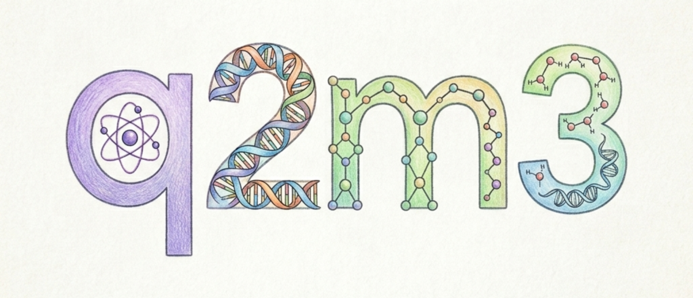

# q2m3: A Hybrid Quantum-Classical QM/MM Simulation Framework

<p align="center">
  
</p>

[](https://www.python.org/downloads/)
[](https://opensource.org/licenses/MIT)
[](https://github.com/yjmaxpayne/q2m3/actions/workflows/docs.yml)
[](https://yjmaxpayne.github.io/q2m3/)
[](https://codecov.io/gh/yjmaxpayne/q2m3)
[](https://doi.org/10.5281/zenodo.20114945)
[](https://pennylane.ai/)
[](https://github.com/PennyLaneAI/catalyst)
[](https://pyscf.org/)

q2m3 is a research framework for hybrid quantum-classical QM/MM
(quantum mechanics / molecular mechanics). It connects PySCF molecular
integrals and Hartree–Fock references with PennyLane Quantum Phase Estimation
(QPE) circuits, explicit MM point charges, Monte Carlo solvation, and sample-based quantum
diagonalization (SQD).

Use it to explore small-molecule QPE workflows and early fault-tolerant
quantum computing (EFTQC) resource estimates. The project is an alpha
proof of concept; its approximations and small-system checks do not establish
production chemistry accuracy.

## Install

Requires Python 3.11+. Choose PyPI for library use, or a source checkout for
the example scripts and development tools.

### From PyPI

In a virtual environment (POSIX shell):

```bash
python -m venv .venv
source .venv/bin/activate
python -m pip install q2m3
```

The package is published as [q2m3 on PyPI](https://pypi.org/project/q2m3/).

### From source

With [uv](https://docs.astral.sh/uv/getting-started/installation/) installed:

```bash
git clone https://github.com/yjmaxpayne/q2m3.git
cd q2m3
uv sync
```

The core install supports the three H₂ starter scripts in the
[example guide](examples/README.md). Optional extras are selected by purpose:

| Extra | Use |
| --- | --- |
| `solvation` | Monte Carlo workflows; includes Catalyst and JAX |
| `catalyst` | Circuit compilation without the full solvation extra |
| `gpu` | GPU dependencies; requires compatible NVIDIA/CUDA setup |
| `viz` | Molecular visualization tools |
| `dev` / `docs` | Tests and code quality tools / Sphinx documentation |
| `sqd` | ffsim/Qiskit SQD workflows; see the [SQD guide](doc/source/sqd.md) |

For example, use `uv sync --extra solvation` in a checkout, or
`python -m pip install "q2m3[solvation]"` in a library environment.

## Minimal Python API

This estimates resources for H₂/STO-3G with an active space of two electrons
in two spatial orbitals, corresponding to four Jordan–Wigner system qubits.
Coordinates are in Å; the target energy error is in Hartree.
Run the snippet with `python` in the PyPI environment or `uv run python` in
the source checkout.

```python
import numpy as np

from q2m3.core import estimate_resources

resources = estimate_resources(
    symbols=["H", "H"],
    coords=np.array([[0.0, 0.0, 0.0], [0.0, 0.0, 0.74]]),
    basis="sto-3g",
    active_electrons=2,
    active_orbitals=2,
    target_error=0.0016,
)
print("System qubits:", resources.n_system_qubits)
print("Logical qubits:", resources.logical_qubits)
print("Toffoli gates:", resources.toffoli_gates)
```

`estimate_resources` returns an `EFTQCResources` object. Logical qubits and
Toffoli gates describe an algorithmic cost model; they do not predict local
simulator runtime or Catalyst compilation memory.

## SQD workflows

In this source checkout, run `uv sync --locked --extra sqd`. Catalyst is
optional for SQD. The unified lock also moves core-only PySCF to 2.14.0;
the measured resource profile is Linux x86_64/Python 3.12.3.

Use `from q2m3 import run_sqd` for molecular geometry, or
`from q2m3.sqd import run_sqd_from_integrals` for an authenticated integral
Hamiltonian and same-frame CCSD seed. Both require an explicit closed-shell
active space and return the complete `SQDResult`. The [SQD guide](doc/source/sqd.md)
provides runnable examples for both, fixed-frame MM semantics, reference
tiers, installation boundaries and resource caps.

Current evidence supports the default two-repetition/100000-shot benchmark
scope. H₂/H₃O⁺ are full-space regressions; Glycine is worse than CCSD for
all five seeds, and N₂ is worse than both CCSD and matched-size SCI. The
original orbital-basis (E1) and connectivity (E6) studies remain inconclusive;
historical four-repetition runs remain out of the certified resource domain.
These results do not establish SQD superiority or quantum hardware readiness.

## Examples and documentation

Start with the [example guide](examples/README.md) for runnable H₂ commands
and the complete script index. It also separates MC workflows from larger
diagnostics.

| Goal | Entry point |
| --- | --- |
| Validate vacuum and MM-embedded QPE | [H₂ QPE tutorial](doc/source/tutorials/h2-qpe-validation.md) |
| Compare resource estimates | [H₂ resource tutorial](doc/source/tutorials/h2-resource-estimation.md) |
| Explore fixed-MO embedding | [Full one-electron example](examples/qmmm/full_oneelectron_embedding.py) |
| Run Monte Carlo solvation | [H₂ MC tutorial](doc/source/tutorials/h2-mc-solvation.md) |
| Understand the model and API | [Documentation site](https://yjmaxpayne.github.io/q2m3/) |

Energies are computed in Hartree and converted explicitly for kcal/mol
reports. QPE–HF differences contain numerical errors as well as correlation
contributions. Fixed-MO MM embedding holds the vacuum orbital frame and
two-electron tensor fixed; runtime MC coefficient updates are diagonal-only.
Read the example boundaries before interpreting energies physically.

## Development, citation, and license

See the [development guide](doc/source/development.md) for test, lint, and
build commands, and [AGENTS.md](AGENTS.md) for contribution conventions.
Keep generated coverage, caches, and benchmark outputs out of commits.

For research use, cite the release that produced your results using
[CITATION.cff](CITATION.cff). q2m3 is released under the [MIT License](LICENSE).

### Runnable capability map

| Goal | Learning path |
|---|---|
| QPE validation and resolution | [QPE examples](examples/qpe/README.md) |
| SQD ground states and scaling | [H₂ → glycine CAS 6/8/10 → integrals](examples/sqd/README.md) |
| Fixed-MO embedding and QPE–MC | [QM/MM examples](examples/qmmm/README.md) |
| Quantum resource estimates | [Resource examples](examples/resources/README.md) |
| Catalyst and compilation costs | [Performance examples](examples/performance/README.md) |

SQD tutorials save complete results, CSV and PNG/SVG figures to unique runs under
`data/output/examples/`. The default glycine scan runs 15 actual points in serial
fresh processes. Calibration, audits and dependency replays are documented in
[Development tools](tools/sqd/README.md).
