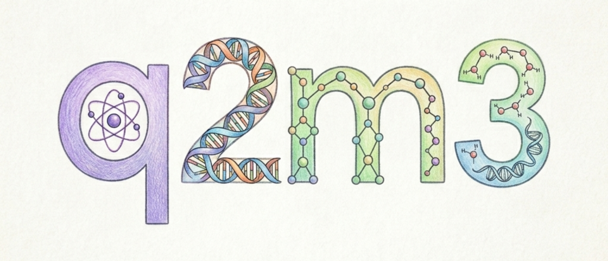

# q2m3: A Hybrid Quantum-Classical QM/MM Simulation Framework

<p align="center">
  
</p>

[](https://www.python.org/downloads/)
[](https://opensource.org/licenses/MIT)
[](https://github.com/yjmaxpayne/q2m3/actions/workflows/docs.yml)
[](https://yjmaxpayne.github.io/q2m3/)
[](https://codecov.io/gh/yjmaxpayne/q2m3)
[](https://doi.org/10.5281/zenodo.20114945)
[](https://pennylane.ai/)
[](https://github.com/PennyLaneAI/catalyst)
[](https://pyscf.org/)

q2m3 is a research framework for hybrid quantum-classical QM/MM
(quantum mechanics / molecular mechanics). It connects PySCF molecular
integrals and Hartree–Fock references to PennyLane Quantum Phase Estimation
(QPE) circuits. It also supports explicit MM point charges, Monte Carlo (MC)
solvation, and sample-based quantum diagonalization (SQD).

Use q2m3 to explore small-molecule QPE workflows and early fault-tolerant
quantum computing (EFTQC) resource estimates. The project is an alpha
proof of concept. Its approximations and small-system checks do not establish
production chemistry accuracy.

## Install

q2m3 requires Python 3.11+. Install from PyPI to use the library. Use a
source checkout to run the example scripts and the development tools.

### From PyPI

In a virtual environment (POSIX shell):

```bash
python -m venv .venv
source .venv/bin/activate
python -m pip install q2m3
```

The package is available as [q2m3 on PyPI](https://pypi.org/project/q2m3/).

### From source

With [uv](https://docs.astral.sh/uv/getting-started/installation/) installed:

```bash
git clone https://github.com/yjmaxpayne/q2m3.git
cd q2m3
uv sync
```

The core install supports the three H₂ starter scripts in the
[example guide](examples/README.md). Select optional extras by purpose:

| Extra | Use |
| --- | --- |
| `solvation` | Monte Carlo workflows (includes Catalyst and JAX) |
| `catalyst` | Circuit compilation without the full solvation extra |
| `gpu` | GPU dependencies (requires a compatible NVIDIA/CUDA setup) |
| `viz` | Molecular visualization tools |
| `dev` / `docs` | Tests and code quality tools / Sphinx documentation |
| `sqd` | ffsim/Qiskit SQD workflows (see the [SQD guide](doc/source/sqd.md)) |

For example, run `uv sync --extra solvation` in a source checkout. In a
library environment, run `python -m pip install "q2m3[solvation]"`.

## Minimal Python API

This snippet estimates resources for H₂/STO-3G. The active space has two
electrons in two spatial orbitals, which gives four Jordan–Wigner system qubits.
Coordinates are in Å. The target energy error is in Hartree.
Run the snippet with `python` in the PyPI environment, or with `uv run python`
in the source checkout.

```python
import numpy as np

from q2m3.core import estimate_resources

resources = estimate_resources(
    symbols=["H", "H"],
    coords=np.array([[0.0, 0.0, 0.0], [0.0, 0.0, 0.74]]),
    basis="sto-3g",
    active_electrons=2,
    active_orbitals=2,
    target_error=0.0016,
)
print("System qubits:", resources.n_system_qubits)
print("Logical qubits:", resources.logical_qubits)
print("Toffoli gates:", resources.toffoli_gates)
```

`estimate_resources` returns an `EFTQCResources` object. The logical-qubit and
Toffoli-gate counts come from an algorithmic cost model. They do not predict
local simulator runtime or Catalyst compilation memory.

## SQD workflows

To install the SQD dependencies in a source checkout, run
`uv sync --frozen --extra sqd`. SQD does not require Catalyst. The public
supervisor requires Linux x86_64 and serial native threads. The unified lock
also moves the core-only PySCF version to 2.14.0. The calibrated resource
profile uses Python 3.12.3.

SQD has two entry points:

- `from q2m3 import run_sqd` starts from a molecular geometry.
- `from q2m3.sqd import run_sqd_from_integrals` starts from an authenticated
  integral Hamiltonian and a same-frame CCSD seed.

Both functions require an explicit closed-shell active space. Both return the
complete `SQDResult`. The [SQD guide](doc/source/sqd.md) gives runnable
examples for both. It also covers fixed-frame MM semantics, reference tiers,
installation boundaries, and resource caps. The
[SQD API reference](doc/source/api-reference/sqd.rst) lists the public
contracts, the authenticated integral producers, and the resource-policy
functions.

Current evidence supports the default benchmark scope of two repetitions and
100000 shots. H₂ and H₃O⁺ are full-space regressions. Glycine is worse than
CCSD for all five seeds. N₂ is worse than both CCSD and matched-size SCI. The
original orbital-basis (E1) and connectivity (E6) studies remain inconclusive.
Historical four-repetition runs remain outside the certified resource domain.
These results do not establish SQD superiority or quantum hardware readiness.

## Examples and documentation

Start with the [example guide](examples/README.md). It gives runnable H₂
commands and the complete script index. It also separates MC workflows from
larger diagnostics.

| Goal | Entry point |
| --- | --- |
| Validate vacuum and MM-embedded QPE | [H₂ QPE tutorial](doc/source/tutorials/h2-qpe-validation.md) |
| Compare resource estimates | [H₂ resource tutorial](doc/source/tutorials/h2-resource-estimation.md) |
| Explore fixed-MO embedding | [Full one-electron example](examples/qmmm/full_oneelectron_embedding.py) |
| Run Monte Carlo solvation | [H₂ MC tutorial](doc/source/tutorials/h2-mc-solvation.md) |
| Run sampled diagonalization end to end | [SQD H₂-to-glycine tutorial](doc/source/tutorials/sqd-showcase.md) |
| Understand the model and API | [Documentation site](https://yjmaxpayne.github.io/q2m3/) |

q2m3 computes energies in Hartree and converts them explicitly for kcal/mol
reports. QPE–HF differences contain numerical errors as well as correlation
contributions. Fixed-MO MM embedding keeps the vacuum orbital frame and the
two-electron tensor fixed. Runtime MC coefficient updates are diagonal-only.
Read the example boundaries before you interpret energies physically.

### Runnable capability map

| Goal | Learning path |
|---|---|
| QPE validation and resolution | [QPE examples](examples/qpe/README.md) |
| SQD ground states and scaling | [H₂ → glycine CAS 6/8/10 → integrals](examples/sqd/README.md) |
| Fixed-MO embedding and QPE–MC | [QM/MM examples](examples/qmmm/README.md) |
| Quantum resource estimates | [Resource examples](examples/resources/README.md) |
| Catalyst and compilation costs | [Performance examples](examples/performance/README.md) |

SQD tutorials save complete results, CSV files, and PNG/SVG figures to a unique
run directory under `data/output/examples/`. The default glycine scan runs 15
actual points in sequence, each in a fresh process. The
[Development tools](tools/sqd/README.md) guide documents calibration, audits,
and dependency replays.

## Development, citation, and license

See the [development guide](doc/source/development.md) for test, lint, and
build commands. See [AGENTS.md](AGENTS.md) for contribution conventions.
Do not commit generated coverage files, caches, or benchmark outputs.

For research use, cite the release that produced your results. Use
[CITATION.cff](CITATION.cff) for the citation metadata. q2m3 uses the
[MIT License](LICENSE).
