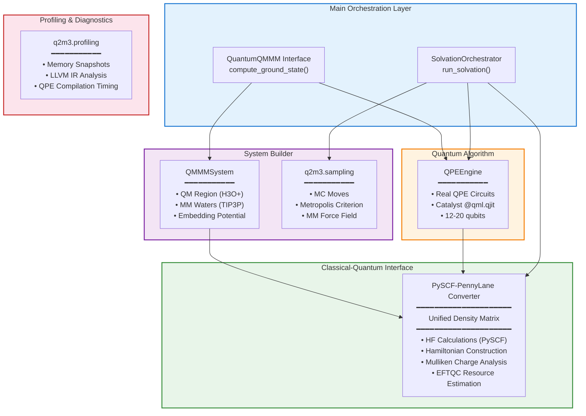

# Quantum-QM/MM: Technical Architecture Overview

**Project**: q2m3 - Hybrid Quantum-Classical QM/MM Framework

**Version**: 0.2.0

**Author**: Ye Jun <yjmaxpayne@hotmail.com>

**Target**: Early Fault-Tolerant Quantum Computers (EFTQC) in the Context of Hybrid Quantum-Classical Computing

---

## Executive Summary

q2m3 is a production-grade hybrid quantum-classical QM/MM framework implementing Quantum Phase Estimation (QPE) with Catalyst QJIT compilation for molecular dynamics simulations. The framework bridges PySCF classical computations with PennyLane quantum circuits via three Hamiltonian modes, enabling Monte Carlo solvation dynamics at quantum accuracy.

**Current Status**: Production-ready QPE circuits with full Catalyst QJIT integration. Real quantum circuits are implemented (HF state preparation, Controlled TrotterProduct time evolution, inverse QFT). The Monte Carlo solvation module (`q2m3.solvation`) supports H2 and H3O+ systems with three Hamiltonian modes optimized for different performance-accuracy trade-offs.

**Key Capabilities**:
- Real QPE quantum circuits compiled by Catalyst `@qml.qjit`
- Three Hamiltonian modes: `fixed` / `hf_corrected` / `dynamic`
- LLVM IR caching eliminating per-step recompilation overhead
- EFTQC hardware resource estimation (logical qubits, Toffoli gates)
- Comprehensive profiling infrastructure (memory, compilation, timing)

---

## Architecture Overview



### Design Principles

1. **Clean Separation**: Quantum (QPE) and classical (PySCF) components remain loosely coupled
2. **Unified Interface**: Density matrices serve as the primary data exchange format
3. **Catalyst-First**: QJIT compilation is a hard dependency (not optional); graceful degradation provided during development
4. **Three-Mode Flexibility**: `fixed` / `hf_corrected` / `dynamic` Hamiltonian modes optimize performance-accuracy trade-offs

---

## Core Components

### 1. QPEEngine (`q2m3.core.qpe`)

**Purpose**: Iterative Quantum Phase Estimation for ground state energy calculation

**Current Implementation** (real quantum circuits):
- HF state preparation via explicit X gates (Catalyst `@qml.qjit`-compatible workaround for `qml.BasisState + qml.ctrl()` interaction)
- Controlled time evolution via `qml.adjoint(qml.TrotterProduct(..., order=2))` — note: TrotterProduct implements exp(+iHt), adjoint gives the required exp(-iHt)
- Inverse QFT via `qml.adjoint(qml.QFT)(wires=estimation_wires)`
- Optional Catalyst `@qml.qjit` via graceful import with no-op fallback

**Catalyst Integration**:
```python
import pennylane as qml

# Actual QPE circuit structure (simplified)
@qml.qjit  # Catalyst QJIT compilation
@qml.qnode(dev)
def qpe_circuit(hamiltonian, hf_state, time):
    # HF state preparation: X gates instead of BasisState
    # (BasisState + ctrl() incompatibility under @qjit)
    for i, wire in enumerate(system_wires):
        if hf_state[i]:
            qml.PauliX(wires=wire)

    # Controlled time evolution: exp(-iHt) per estimation wire
    qml.ctrl(
        qml.adjoint(qml.TrotterProduct(hamiltonian, time, n=n_trotter_steps, order=2)),
        control=estimation_wire,
    )

    # Inverse QFT on estimation register
    qml.adjoint(qml.QFT)(wires=estimation_wires)
    return qml.probs(wires=estimation_wires)
```

**Key Features**:
- Jordan-Wigner fermion-to-qubit mapping via `qml.qchem.molecular_hamiltonian()`
- Returns energy, convergence information, and IR cache statistics
- Target energy resolution configurable via `QPEConfig.target_resolution`

---

### 2. QuantumQMMM (`q2m3.core.quantum_qmmm`)

**Purpose**: Main interface coordinating the entire QM/MM workflow

**Workflow**:
1. Build QM/MM Hamiltonian with MM point charge embedding
2. Execute QPE for ground state energy estimation
3. Perform Mulliken population analysis for atomic charges
4. Return comprehensive results dictionary

**Scientific Correctness**:
- Proper Mulliken charge partitioning: P_μν × S_μν summation
- Charge conservation validated (H3O+ total charge = +1.0)
- Handles both restricted and unrestricted HF density matrices

**Example Usage**:
```python
from q2m3 import QuantumQMMM, load_xyz

# Load H3O+ structure
h3o_atoms = load_xyz("data/h3o_plus.xyz")

# Configure QPE
qpe_config = {
    "algorithm": "iterative",
    "iterations": 8,
    "system_qubits": 12,
    "error_tolerance": 0.005,
    "use_real_qpe": True,
}

# Run calculation
qmmm = QuantumQMMM(qm_atoms=h3o_atoms, mm_waters=8, qpe_config=qpe_config)
results = qmmm.compute_ground_state()

# Results:
# - energy: -75.326464 Hartree (HF/STO-3G)
# - atomic_charges: {'O0': -2.0, 'H1': +1.0, ...}
# - convergence: {'converged': True, 'iterations': 5}
```

---

### 3. QMMMSystem (`q2m3.core.qmmm_system`)

**Purpose**: Build and manage QM/MM partitioning with solvation environment

**Features**:
- **QM Region**: H3O+ (4 atoms) treated quantum mechanically
- **MM Region**: 6-8 TIP3P water molecules in first solvation shell
- **Water Model**: Correct TIP3P parameters (O-H: 0.9572 Å, charges: O -0.834e, H +0.417e)
- **Placement**: Spherical distribution around QM center (3.0 Å radius)

**Embedding Potential**:
- Returns MM point charges and coordinates for QM calculation
- Simple electrostatic embedding (no polarization in current implementation)

---

### 4. PySCF-PennyLane Converter (`q2m3.interfaces.pyscf_pennylane`)

**Purpose**: Bidirectional data conversion between classical and quantum frameworks

**Implemented**:
- `UnifiedDensityMatrix`: Validates Hermiticity, converts state vectors ↔ density matrices
- `build_qmmm_hamiltonian()`: Runs PySCF HF with MM embedding, returns molecular data
- `compute_overlap_integrals()`: Calculates overlap matrix for Mulliken analysis
- `pyscf_to_pennylane_hamiltonian()`: Converts molecular integrals to PennyLane qubit operators via `qml.qchem.molecular_hamiltonian()`
- `extract_molecular_orbitals()`: MO coefficient extraction for state preparation
- `to_pennylane_observable()`: Transforms density matrix to PennyLane observable
- `estimate_qpe_resources()`: EFTQC resource estimation (logical qubits, Toffoli gates, Hamiltonian 1-norm)

**Hamiltonian construction pattern**:
```python
# PennyLane 0.44+ returns Sum, not Hamiltonian
import pennylane as qml

H, n_qubits = qml.qchem.molecular_hamiltonian(
    symbols, coordinates,
    charge=1,       # H3O+
    basis="sto-3g",
    mapping="jordan_wigner",
)
# H is a qml.ops.Sum; use H.operands to iterate terms
```

---

## q2m3.solvation — Monte Carlo Dynamics

The solvation module implements a complete QPE-driven Monte Carlo framework for studying molecular systems in explicit solvent. It is the primary production interface for solvation dynamics simulations.

### Three Hamiltonian Modes

| Mode | Hamiltonian Source | QPE Frequency | Performance | Accuracy |
|------|-------------------|---------------|-------------|----------|
| `fixed` | Vacuum (pre-compiled once) | Every MC step | Fastest | No MM embedding in energy |
| `hf_corrected` | E_HF + E_MM (analytical) | Every `qpe_interval` steps | Fast | Approximate MM correction |
| `dynamic` | Per-step MM-embedded H | Every MC step | Rigorous | Full QM/MM coupling |

**Key Innovation (ADR-003)**: TrotterProduct Hamiltonian coefficients are JAX-traceable runtime parameters under `@qml.qjit`. This eliminates the 67s per-step recompilation bottleneck in naive dynamic mode implementations — the circuit structure is compiled once, coefficients update at runtime.

### Primary API

```python
from q2m3.solvation import SolvationConfig, MoleculeConfig, QPEConfig, run_solvation

config = SolvationConfig(
    molecule=MoleculeConfig(
        name="H2",
        symbols=["H", "H"],
        coords=[[0, 0, 0], [0, 0, 0.74]],
        charge=0,
    ),
    hamiltonian_mode="fixed",   # "fixed" | "hf_corrected" | "dynamic"
    n_waters=10,
    n_mc_steps=100,
    qpe=QPEConfig(
        n_estimation_wires=4,
        n_trotter_steps=10,
        n_shots=0,              # 0 = analytical (default)
        qpe_interval=10,        # For hf_corrected mode
    ),
)
result = run_solvation(config, show_plots=False)
```

### Configuration Dataclasses

| Class | Purpose |
|-------|---------|
| `MoleculeConfig` | Molecular system: symbols, coordinates, charge, active space |
| `QPEConfig` | QPE parameters: estimation wires, Trotter steps, shots, energy range |
| `SolvationConfig` | Top-level config: molecule, mode, n_waters, n_mc_steps, QPE config |

### Module Structure

| File | Role |
|------|------|
| `orchestrator.py` | `run_solvation()` entry point; coordinates full MC workflow |
| `energy.py` | Three-mode energy computation; deferred `@qjit` compilation callbacks |
| `circuit_builder.py` | `build_qpe_circuit()` → `QPECircuitBundle`; Catalyst circuit construction |
| `mc_loop.py` | `create_mc_loop()` → `MCResult`; Monte Carlo sampling loop |
| `ir_cache.py` | LLVM IR caching (compile once, reuse across steps) |
| `config.py` | Frozen dataclasses: `SolvationConfig`, `MoleculeConfig`, `QPEConfig` |
| `phase_extraction.py` | Phase bit → energy conversion |
| `solvent.py` | TIP3P water geometry, solvent ring initialization |
| `statistics.py` | MC timing statistics, Rich console output |
| `plotting.py` | Energy trajectory visualization |
| `analysis.py` | δ_corr-pol polarization energy analysis |

---

## q2m3.profiling — Performance Analysis

Systematic profiling infrastructure for QPE compilation and memory usage.

### Memory Profiling

```python
from q2m3.profiling import MemorySnapshot, ProfileResult, take_snapshot

snapshot = take_snapshot(label="before_qjit")
# ... run QPE ...
result = ProfileResult(snapshots=[snapshot, take_snapshot("after_qjit")])
```

**Key classes**: `MemorySnapshot`, `MemoryTimeline`, `ProfileResult`, `ParentSideMonitor`

### LLVM IR Analysis

```python
from q2m3.profiling import analyze_ir_stages, COMPILATION_STAGES

# Analyze Catalyst compilation pipeline stages
stage_sizes = analyze_ir_stages(ir_output_dir())
```

**Compilation stages tracked**: quantum IR → MLIR → LLVM IR → optimized LLVM IR

### QPE Compilation Profiling

```python
from q2m3.profiling import profile_qjit_compilation, profile_execution

compile_result = profile_qjit_compilation(hamiltonian, config)
exec_result = profile_execution(compiled_fn, hamiltonian, config)
```

**Timing utilities**: `profile_function()`, `profile_section()` (context manager), `ProfilingStats`

---

## q2m3.sampling — Monte Carlo Sampling

Molecular mechanics sampling layer supporting MC solvation dynamics.

| Module | Contents |
|--------|---------|
| `mc_moves.py` | Translation/rotation moves for water molecules |
| `metropolis.py` | Metropolis-Hastings acceptance criterion |
| `mm_forcefield.py` | TIP3P classical force field evaluation |
| `water_molecule.py` | Water geometry and TIP3P parameter definitions |

---

## EFTQC Resource Estimation (`q2m3.core.resource_estimation`)

Structured hardware resource estimation for Early Fault-Tolerant Quantum Computer planning.

```python
from q2m3.core.resource_estimation import estimate_resources, EFTQCResources
from q2m3.interfaces import PySCFPennyLaneConverter

converter = PySCFPennyLaneConverter()
resources: EFTQCResources = estimate_resources(
    converter=converter,
    symbols=["H", "H"],
    coordinates=[[0, 0, 0], [0, 0, 0.74]],
    charge=0,
    target_error=0.001,
)

print(f"Logical qubits: {resources.logical_qubits}")
print(f"Toffoli gates:  {resources.toffoli_gates}")
print(f"Hamiltonian λ:  {resources.hamiltonian_1norm:.4f} Ha")
```

**`EFTQCResources` fields**:

| Field | Description |
|-------|-------------|
| `hamiltonian_1norm` | Hamiltonian λ (1-norm) in Hartree |
| `logical_qubits` | Required logical qubit count |
| `toffoli_gates` | Non-Clifford (Toffoli) gate count |
| `n_terms` | Number of Hamiltonian Pauli terms |
| `target_error` | Target energy error in Hartree |
| `n_system_qubits` | System register size = n_orbitals × 2 (JW) |
| `basis` | Basis set (e.g. `"sto-3g"`) |
| `n_mm_charges` | Number of MM point charges; 0 for vacuum |

**`ResourceComparisonResult`**: Compares vacuum vs. solvated resource estimates, including δλ (% change in Hamiltonian 1-norm) and δ Toffoli gate count due to MM embedding.

---

## Code Quality Metrics

| Metric | Score | Details |
|--------|-------|---------|
| **Type Hint Coverage** | 100% | All functions fully typed |
| **Docstring Coverage** | 100% | Google-style docstrings |
| **Test Count** | 417 tests | `uv run pytest --collect-only -q` |
| **PEP 8 Compliance** | ✅ | Black (line-length=100) + Ruff verified |
| **Cyclomatic Complexity** | 32/33 ≤ 10 | Excellent maintainability |

**Testing Strategy**:
- Unit tests: QPEEngine, QMMMSystem, Converters, all solvation submodules
- Integration tests: full QM/MM workflow, MC solvation end-to-end
- Scientific validation: energy ranges, charge conservation, QPE convergence
- Parametrized tests: multiple qubit/iteration/mode configurations

---

## Scientific Validation

### H3O+ Test Case Results

```
System: H3O+ + 8 TIP3P waters
Method: HF/STO-3G with QPE (real quantum circuits)
Ground State Energy: -75.326464 Hartree ✓
Mulliken Charges: O(-2.0) + 3H(+1.0 each) = +1.0 total ✓
Convergence: 5 iterations ✓
Active Space: (4e, 4o) → 8 system qubits + 4 estimation qubits = 12 total
```

**Validation**:
- Energy is chemically reasonable (H3O+ HF/STO-3G: ~-75 to -76 Hartree)
- Charge conservation verified
- MM environment geometry realistic (3.0 Å solvation shell)

**H3O+ QPE-HF gap**: The ~1.18 Ha vacuum gap is dominated by 4-bit phase estimation systematic error, not true correlation energy. The δ_corr-pol estimate uses H2 correlation energy as a proxy.

---

## Catalyst Integration

Catalyst QJIT compilation is a hard dependency (ADR-004). The framework provides graceful degradation via a no-op `qjit` fallback when Catalyst is not installed, enabling development without the full stack.

### Current Integration Status

**Implemented**:
- `@qml.qjit` applied to QPE circuit (not `@catalyst.qjit` — use the PennyLane decorator)
- `qml.for_loop()` replaces Python `for` in Catalyst-compiled paths
- TrotterProduct Hamiltonian coefficients parameterized as JAX-traceable runtime values
- LLVM IR caching via `ir_cache.py` to amortize compilation cost across MC steps

**Correct usage pattern**:
```python
import pennylane as qml
from catalyst import qjit  # Or import via qml.qjit

@qml.qjit  # NOT @catalyst.qjit
@qml.qnode(dev)
def qpe_circuit(hamiltonian_coeffs, hamiltonian_ops, hf_state, time):
    # HF state preparation (X gates, not BasisState — QJIT compat)
    def prepare_body(i, _):
        qml.cond(hf_state[i] == 1, qml.PauliX)(wires=system_wires[i])
        return _

    qml.for_loop(0, n_system, 1)(prepare_body)(None)

    # Controlled time evolution
    H_runtime = qml.dot(hamiltonian_coeffs, hamiltonian_ops)
    qml.ctrl(
        qml.adjoint(qml.TrotterProduct(H_runtime, time, n=n_steps, order=2)),
        control=estimation_wire,
    )

    # Inverse QFT
    qml.adjoint(qml.QFT)(wires=estimation_wires)
    return qml.probs(wires=estimation_wires)
```

### Performance Characteristics

| Scenario | Expected Behavior |
|----------|------------------|
| First call | JIT compilation (~seconds, cached to LLVM IR) |
| Subsequent calls (same structure) | Near-native execution speed |
| `fixed` mode | Compile once, vacuum H constant — fastest per step |
| `dynamic` mode | Runtime coefficient update via JAX tracing — no recompilation |
| `hf_corrected` mode | QPE every `qpe_interval` steps — best throughput/accuracy balance |

### Future Directions

- GPU acceleration via `lightning.gpu` device (requires CUDA ≥ 11.0, 16 GB+ GPU memory)
- Adaptive QPE convergence with `qml.while_loop()` for early termination
- Distributed QC-HPC architecture for larger active spaces

---

## Honest Limitations

### Current Implementation Scope

1. **Chemical Accuracy**: HF-level only (no electron correlation like CCSD/CASPT2)
2. **MM Embedding**: Simple point charges (no polarization or advanced force fields)
3. **System Size**: Validated for H2 (2e, 2o) and H3O+ (4e, 4o); larger systems untested
4. **QPE Precision**: Limited by number of estimation wires (4-bit default → ~0.06 Ha resolution)
5. **I/O Utilities**: Undertested (18.75% coverage — `utils/plotting.py`)

---

## Getting Started

### Installation

```bash
# Clone repository
git clone https://github.com/yjmaxpayne/q2m3.git
cd q2m3

# Install all dependencies (core + dev + Catalyst + solvation)
uv sync --all-extras

# Install only core dependencies (production, no dev tools)
uv sync --no-dev

# Install with Catalyst support only
uv sync --extra catalyst

# Or use make targets
make sync       # equivalent to uv sync --all-extras
make install    # equivalent to uv sync --no-dev
```

### Run Examples

```bash
# Chapter 1: Static QPE (~30 seconds)
uv run python examples/h2_qpe_validation.py

# Chapter 1: EFTQC resource estimation
uv run python examples/h2_resource_estimation.py

# Chapter 2: MC Solvation — H2 fixed-mode QPE
uv run python examples/h2_mc_solvation.py

# Chapter 2: MC Solvation — H3O+ hf_corrected mode
uv run python examples/h3o_mc_solvation.py

# Chapter 2: Three-mode comparison (fixed / hf_corrected / dynamic)
uv run python examples/h2_three_mode_comparison.py

# Profiling & Tools
uv run python examples/catalyst_benchmark.py
uv run python examples/qpe_memory_profile.py
```

### Run Tests

```bash
# Full test suite
uv run pytest tests/ -v

# With coverage report
uv run pytest tests/ --cov=src/q2m3 --cov-report=html --cov-report=term

# Single module
uv run pytest tests/solvation/ -v
```

---

## Repository Structure

```
q2m3/
├── src/q2m3/
│   ├── core/                       # Core computational engines
│   │   ├── qpe.py                  # QPEEngine (real circuits + Catalyst QJIT)
│   │   ├── quantum_qmmm.py         # QuantumQMMM main interface
│   │   ├── qmmm_system.py          # QM/MM system builder
│   │   ├── resource_estimation.py  # EFTQCResources + estimate_resources()
│   │   ├── device_utils.py         # Device selection utilities
│   │   └── hamiltonian_utils.py    # Hamiltonian decomposition helpers
│   ├── interfaces/                 # PySCF-PennyLane bridge
│   │   └── pyscf_pennylane.py      # Converter + resource estimation
│   ├── solvation/                  # MC dynamics framework (10 modules)
│   │   ├── orchestrator.py         # run_solvation() entry point
│   │   ├── config.py               # SolvationConfig, MoleculeConfig, QPEConfig
│   │   ├── energy.py               # Three-mode energy computation
│   │   ├── circuit_builder.py      # QPECircuitBundle construction
│   │   ├── mc_loop.py              # MC loop + MCResult
│   │   ├── ir_cache.py             # LLVM IR caching
│   │   ├── phase_extraction.py     # Phase → energy conversion
│   │   ├── solvent.py              # TIP3P geometry + solvent ring
│   │   ├── statistics.py           # MC statistics + Rich console output
│   │   ├── plotting.py             # Energy trajectory plots
│   │   └── analysis.py             # δ_corr-pol analysis
│   ├── profiling/                  # Performance analysis (5 modules)
│   │   ├── memory.py               # MemorySnapshot, ProfileResult
│   │   ├── catalyst_ir.py          # LLVM IR stage analysis
│   │   ├── qpe_profiler.py         # QPE compilation profiling
│   │   ├── timing.py               # ProfilingStats, profile_section()
│   │   └── orchestrator.py         # Sweep/batch profiling runner
│   ├── sampling/                   # MC sampling primitives (4 modules)
│   │   ├── mc_moves.py             # Translation/rotation moves
│   │   ├── metropolis.py           # Metropolis-Hastings criterion
│   │   ├── mm_forcefield.py        # TIP3P force field
│   │   └── water_molecule.py       # Water geometry definitions
│   ├── utils/                      # I/O utilities
│   │   └── io.py                   # load_xyz, save_json_results
│   ├── molecule.py                 # Molecule data structures
│   ├── constants.py                # Physical constants
│   └── __init__.py                 # Public API exports
├── tests/                          # Test suite (417 tests)
│   ├── core/
│   ├── solvation/
│   ├── profiling/
│   ├── sampling/
│   └── interfaces/
├── examples/                       # Production examples
│   ├── h2_qpe_validation.py        # Chapter 1: Static QPE (core API)
│   ├── h2_resource_estimation.py   # Chapter 1: EFTQC resource estimation
│   ├── h2_mc_solvation.py          # Chapter 2: MC Solvation (solvation API)
│   ├── h3o_mc_solvation.py         # Chapter 2: H3O+ hf_corrected mode
│   ├── h2_three_mode_comparison.py # Chapter 2: Three-mode comparison
│   ├── catalyst_benchmark.py       # Profiling: Catalyst JIT benchmarking
│   ├── qpe_memory_profile.py       # Profiling: QPE memory profiling
│   └── _archived/                  # Superseded POC scripts
├── data/
│   └── h3o_plus.xyz                # H3O+ input geometry
├── pyproject.toml                  # Project configuration (uv)
├── uv.lock                         # Reproducible dependency lock
├── Makefile                        # Build automation
└── README.md                       # User guide
```

---

## Technical Contact

**Author**: Ye Jun
**Email**: yjmaxpayne@hotmail.com
**Repository**: [github.com/yjmaxpayne/q2m3](https://github.com/yjmaxpayne/q2m3)

---

*Last Updated: 2026-03-01*
*Document Version: 2.0*
