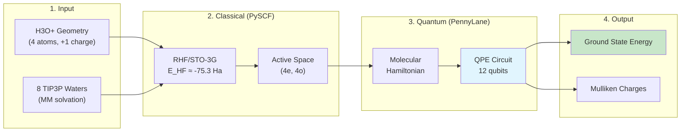

# H3O+ Quantum Phase Estimation Demo

> **q2m3 MVP** - Hybrid Quantum-Classical QM/MM for Early Fault-Tolerant Quantum Computers (EFTQC)

## Overview

This demo showcases the complete q2m3 workflow for molecular ground state energy estimation using Quantum Phase Estimation (QPE), with optional PennyLane Catalyst JIT compilation support.

**Key Capabilities Demonstrated:**
- PySCF → PennyLane molecular Hamiltonian conversion
- Standard QPE circuit with Trotter time evolution
- QM/MM system setup with TIP3P water solvation
- Catalyst `@qjit` compilation for performance optimization
- Mulliken population analysis

## Pipeline



## Quick Start

```bash
# Activate virtual environment
source .venv/bin/activate

# Run the demo
python examples/h3o_quantum_qpe.py

# Or use Makefile
make run-example
```

## Test System: H3O+ (Hydronium Ion)

```
        H (+1.0)
         \
          O (-2.0) ─── H (+1.0)      Total charge: +1
         /
        H (+1.0)

Geometry (Angstrom):
  O:  ( 0.000,  0.000,  0.000)
  H:  ( 0.960,  0.000,  0.000)
  H:  (-0.480,  0.831,  0.000)
  H:  (-0.480, -0.831,  0.000)
```

## Quantum Resource Configuration

| Parameter | Value | Description |
|-----------|-------|-------------|
| **Active Space** | 4e, 4o | 4 electrons in 4 spatial orbitals |
| **System Qubits** | 8 | 4 orbitals × 2 spin = 8 spin orbitals |
| **Estimation Qubits** | 4 | Precision bits for phase readout |
| **Total Qubits** | **12** | System + estimation registers |
| **Qubit Mapping** | Jordan-Wigner | Fermion-to-qubit encoding |
| **Trotter Steps** | 10 | Time evolution accuracy |
| **Base Time** | 0.1 | Evolution time parameter |
| **Shots** | 100 | Measurement statistics |

## Demo Workflow (5 Steps)

| Step | Description | Output |
|------|-------------|--------|
| **Step 1** | System Configuration | QM/MM setup, quantum resources |
| **Step 2** | Standard QPE Execution | Energy with `default.qubit` |
| **Step 3** | Catalyst QPE Execution | Energy with `lightning.qubit` + `@qjit` |
| **Step 4** | Results Comparison | Time speedup, energy consistency |
| **Step 5** | Save Results | JSON output to `data/output/` |

## Expected Output

```
================================================================================
                    H3O+ Quantum Phase Estimation (QPE) Demo
                    q2m3 MVP - Catalyst Technical Validation
================================================================================
Timestamp: 2025-11-26 XX:XX:XX
Catalyst Available: Yes (vX.X.X)

[Step 1] System Configuration
--------------------------------------------------------------------------------
QM Region: H3O+ (4 atoms, total charge +1)
MM Region: 8 TIP3P water molecules

Quantum Resource Requirements:
  Active Space: 4 electrons, 4 orbitals
  System Qubits: 8 (spin orbitals)
  Estimation Qubits: 4 (precision bits)
  Total Qubits: 12

[Step 2] Standard QPE Execution (No Catalyst)
--------------------------------------------------------------------------------
Execution Time: X.XXX s
Energy Results:
  HF Reference Energy: -75.XXXXXX Hartree
  QPE Estimated Energy: -XX.XXXXXX Hartree

[Step 4] Results Comparison
--------------------------------------------------------------------------------
Execution Time Comparison:
  Standard QPE: X.XXX s
  Catalyst QPE: X.XXX s
  Speedup: X.XXx faster with Catalyst

Demo Summary
--------------------------------------------------------------------------------
q2m3 MVP Capabilities Demonstrated:
  [OK] PySCF -> PennyLane Hamiltonian conversion
  [OK] Standard QPE circuit implementation
  [OK] HF state preparation (qml.BasisState)
  [OK] Trotter time evolution (qml.TrotterProduct)
  [OK] Inverse QFT (qml.adjoint(qml.QFT))
  [OK] Phase-to-energy extraction
  [OK] QM/MM system with TIP3P solvation
  [OK] Mulliken population analysis
  [OK] Catalyst @qjit JIT compilation
```

## Catalyst Integration

The demo compares two execution modes:

| Mode | Device | Compilation | Use Case |
|------|--------|-------------|----------|
| **Standard** | `default.qubit` | Python interpreter | Development, debugging |
| **Catalyst** | `lightning.qubit` | MLIR/LLVM via `@qjit` | Production, large circuits |

**Install Catalyst:**
```bash
pip install pennylane-catalyst pennylane-lightning
```

## Output Files

Results are saved to `data/output/h3o_quantum_qpe_results.json`:

```json
{
  "timestamp": "2025-11-26T...",
  "catalyst_available": true,
  "system": {"qm_region": "H3O+", "n_atoms": 4, "total_charge": 1},
  "quantum_resources": {"total_qubits": 12, ...},
  "results_standard": {"energy": -XX.XX, "execution_time_s": X.X},
  "results_catalyst": {"energy": -XX.XX, "execution_time_s": X.X}
}
```

## References

- [PennyLane QPE Tutorial](https://pennylane.ai/qml/demos/tutorial_qpe/)
- [PennyLane Catalyst Documentation](https://docs.pennylane.ai/projects/catalyst/)
- [q2m3 Technical Overview](../TECHNICAL_OVERVIEW.md)
